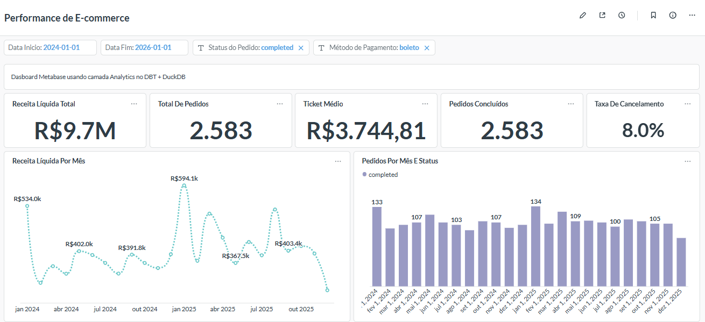
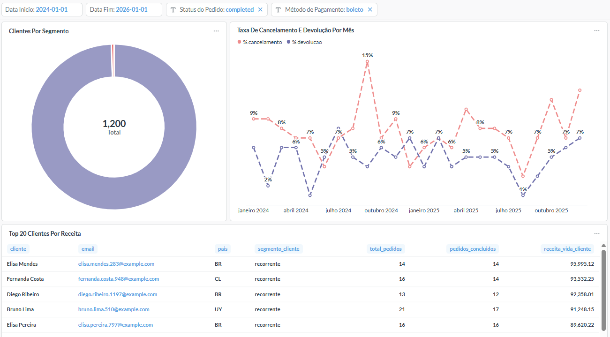
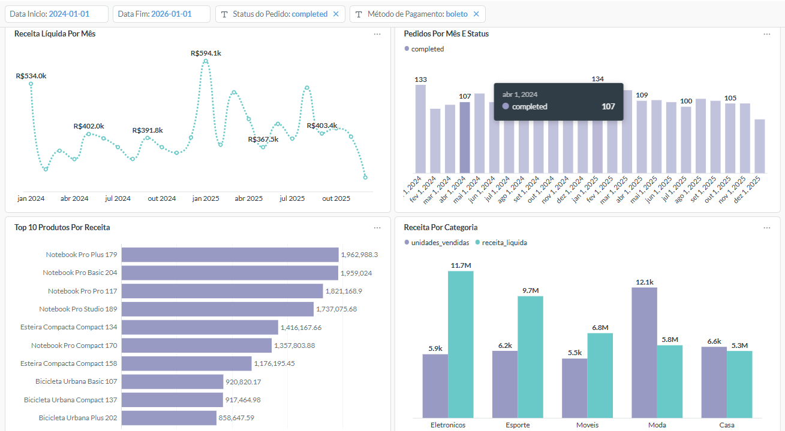

# Portfolio: dbt + DuckDB + Metabase

Case de e-commerce criado para demonstrar competências de Analista de Dados Sênior em modelagem analítica, qualidade de dados, documentação e visualização.

## Resultado

Dashboard criado no Metabase sobre a camada `analytics` do dbt.







## Arquitetura

```text
CSV sintético
  -> dbt seeds
  -> modelos dbt em camadas
  -> DuckDB
  -> Metabase
```

## Camadas

| Camada | Saída | Responsabilidade |
| --- | --- | --- |
| `raw` | `bruto_*` | Carga inicial dos CSVs. |
| `staging` | `preparacao_*` | Limpeza, tipos e padronização. |
| `quality` | `qualidade_*` | Enriquecimento, joins e regras de negócio. |
| `analytics` | `analise_*` | Tabelas finais para BI. |

## Métricas analisadas

- Receita líquida.
- Total de pedidos.
- Ticket médio.
- Pedidos por status.
- Receita por método de pagamento.
- Top produtos por receita.
- Receita por categoria.
- Clientes por segmento.
- Top clientes por lifetime revenue.
- Cancelamentos e devoluções.

## Qualidade

O projeto usa testes dbt para validar:

- chaves não nulas;
- unicidade;
- integridade referencial;
- valores aceitos;
- regra customizada para pedidos concluídos com receita positiva.

## Como reproduzir

```powershell
cd C:\Users\Acer\Documents\PROJETOS\DBT
.\.venv\Scripts\dbt.exe build --profiles-dir .
```

Documentação dbt:

```powershell
.\.venv\Scripts\dbt.exe docs generate --profiles-dir .
.\.venv\Scripts\dbt.exe docs serve --profiles-dir .
```

Metabase:

```powershell
cd Metabase
Set-ExecutionPolicy -Scope Process -ExecutionPolicy Bypass
.\start_metabase_local.ps1
```

## Evidências preservadas

- Prints: `Metabase/dashboard-assets/screenshots/`
- Backup do Metabase: `Metabase/backups/`
- SQLs de apoio: `Metabase/queries/analytics_examples.sql`
